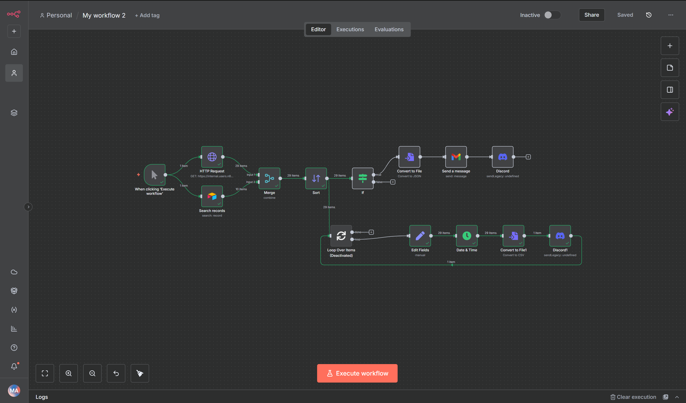

# 🌍 Customer Data Automation with n8n

### Automate Airtable updates, enrich customer data, and send smart notifications — all with n8n.

---

## 🚀 Overview

This project contains a set of **n8n workflows** designed to automate customer data management and notifications.  
It integrates Airtable, public APIs, Gmail, and Discord into a seamless data pipeline.

With these workflows, you can:
- Automatically enrich customer records with country information.
- Process and sort customer orders.
- Send alerts and summaries via email and Discord.
- Get notified in real time if any workflow errors occur.

---

## 🧩 Workflows

### 🗺️ **1. Country Enrichment**
**File:** `country-enrichment.json`  
- Fetches country data (region, subregion) from the REST Countries API.  
- Merges the data with existing customer records in Airtable.  
- Updates Airtable automatically with enriched details.

📸 *Screenshot Example:*  


---

### 📦 **2. Order Processing & Notifications**
**File:** `order-processing.json`  
- Retrieves order data from Airtable.  
- Sorts and processes records by order value.  
- Generates JSON files for each order.  
- Sends notifications through Gmail and Discord for real-time tracking.

📸 *Screenshot Example:*  


---

### ⚠️ **3. Error Handler**
**File:** `error-handler.json`  
- Automatically triggered when another workflow fails.  
- Sends detailed error reports to a Discord channel for quick debugging.  

📸 *Screenshot Example:*  


---

## 🔒 Security

All sensitive information (API tokens, IDs, URLs, and emails) has been **removed** and replaced with environment placeholders, such as:

```bash
{{AIRTABLE_BASE_ID}}
{{AIRTABLE_TABLE_ID}}
{{DISCORD_WEBHOOK_URL}}
{{GMAIL_ACCOUNT}}
````

To run the workflows, simply set these credentials in your **n8n credentials manager** or use your environment variables.

---

## ⚙️ Setup Instructions

### 1. **Clone this Repository**

```bash
git clone https://github.com/your-username/n8n-customer-automation.git
cd n8n-customer-automation
```

### 2. **Import Workflows into n8n**

* Open your **n8n dashboard**.
* Click **Import Workflow**.
* Upload the three `.json` files:

  * `country-enrichment.json`
  * `order-processing.json`
  * `error-handler.json`

### 3. **Add Your Credentials**

Create or link credentials in n8n for:

* Airtable
* Gmail
* Discord (webhook)
* Any additional APIs (if needed)

### 4. **Run or Schedule**

* Execute manually using the **manual trigger**, or
* Add a **cron trigger** to automate runs on schedule.

Monitor all executions under the **Executions** tab in n8n.

---

## 🧠 Why This Project

This project demonstrates how **n8n** can serve as a powerful, low-code backend to:

* Integrate multiple APIs.
* Enrich and maintain customer databases.
* Handle communications and monitoring without custom server code.

---

## 🏗️ Tech Stack

| Tool / Service         | Purpose                           |
| ---------------------- | --------------------------------- |
| **n8n**                | Workflow automation               |
| **Airtable API**       | Customer data storage             |
| **REST Countries API** | Country enrichment                |
| **Gmail API**          | Email notifications               |
| **Discord Webhooks**   | Real-time alerts & error handling |

---

## 📂 Repository Structure

```
n8n-customer-automation/
│
├── country-enrichment.json
├── order-processing.json
├── error-handler.json
├── screenshots/
│   ├── country-enrichment.png
│   ├── order-processing.png
│   └── error-handler.png
└── README.md
```

---

## 📄 License

This project is open source and available under the **MIT License**.
Feel free to fork, modify, and build upon it.

---

## 💡 Author

Created by **Mohammed Algald** — powered by n8n ⚙️
If you find this helpful, ⭐ star the repo or connect with me on [LinkedIn](https://www.linkedin.com/in/mohammed-aljald-a801bb228/).

---

